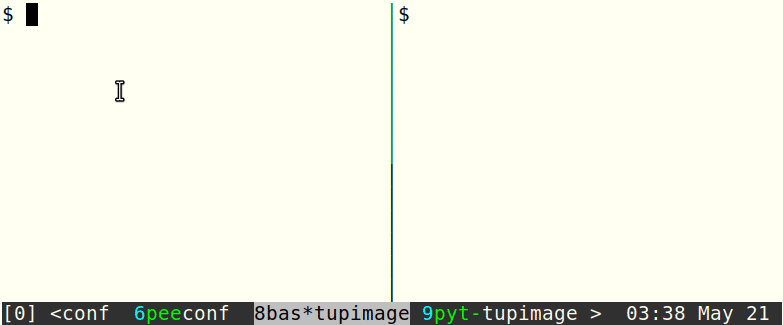

# Tupimage

`tupimage` is a utility for uploading and displaying terminal images using the
Unicode placeholder extension of the kitty graphics protocol. The Unicode
placeholder extension allows placing images using a special placeholder
character, which makes this approach suitable for text-based applications like
tmux and vim, which know nothing about the graphics protocol.

Currently the Unicode placeholder extension is supported only by the following
forks:
- [this fork of Kitty](https://github.com/sergei-grechanik/kitty/tree/unicode-placeholders)
- [this fork of st](https://github.com/sergei-grechanik/st/tree/graphics)

## Installation

Just copy `tupimage` somewhere on your PATH. The script is written in bash (uses
bash-specific features) and requires some utilities, like bc for computing the
best number of rows/columns and ImageMagick for reading image info and image
conversion.

In the future I'll probably rewrite it in python since it became too complex for
a bash script.

## Usage

TODO
